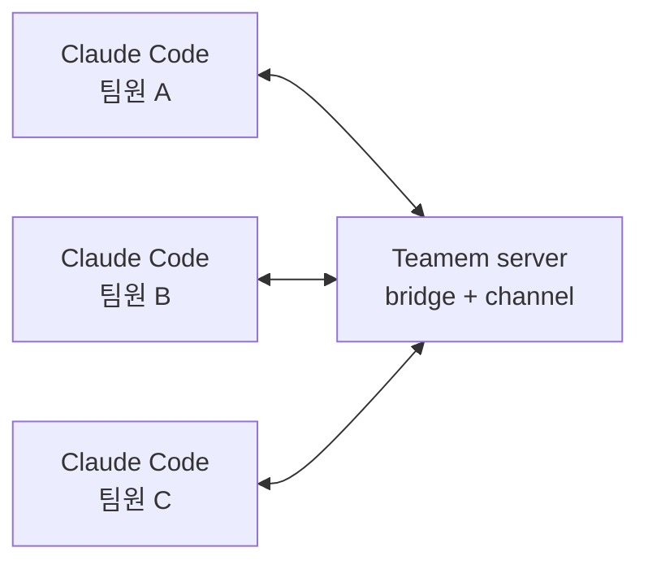

# Teamem

[English](README.md) | [한국어](README.ko.md)

Teamem은 사람과 코딩 에이전트를 위한 팀 메모리입니다. 같은 리포지토리에서
Claude Code를 쓰는 팀원들이 작업 맥락을 공유하고, 코드 수정 범위를 조율하고,
주요 결정사항들을 기록하며, 작업을 충돌없이 안전하게 이어갈 수 있게 돕기 위해 만들어졌습니다.

Teamem은 이런 상황에서 유용합니다:

- 여러 팀원이 하나의 코드베이스(리포지토리)에서 Claude Code를 함께 사용할 때
- 모든 팀원과 에이전트 세션이 현재 작업 방향, 결정, 트러블슈팅 내역 등을 알아야 할 때
- 커밋하면 자동으로 해제되는 파일 단위 클레임이 필요할 때
- 팀 지식을 특정 채팅 기록에만 남기지 않고 보존하고 싶을 때

## 빠른 시작

Teamem을 사용하려면 공유 서버가 먼저 필요합니다. 팀에서 이미 운영 중인
서버가 있다면, 이 저장소를 clone한 뒤 직접 호스팅하세요.

Docker Compose로 실행:

```bash
git clone https://github.com/RubiYH/teamem.git
cd teamem
cp .env.example .env
# .env에 TEAMEM_JWT_SECRET을 설정하세요. 로컬 테스트 예시:
#   openssl rand -hex 32
docker compose up --build -d
```

Bun으로 직접 실행:

```bash
git clone https://github.com/RubiYH/teamem.git
cd teamem
bun install
cp .env.example .env
# .env에 TEAMEM_JWT_SECRET을 설정하세요. 로컬 테스트 예시:
#   openssl rand -hex 32
mkdir -p data
bun run server
```

서버가 준비되면 각 팀원 머신에 Bun이 설치되어 있는지 먼저 확인하세요:

```bash
curl -fsSL https://bun.sh/install | bash
```

그 다음 부트스트래퍼 CLI를 설치하고 Claude Code 설정을 진행하세요:

```bash
npm install -g teamem
teamem init
teamem cc
```

`teamem init`은 필수 도구를 점검하고, `teamem-alpha` Claude Code
마켓플레이스를 추가하거나 갱신한 뒤, `teamem@teamem-alpha` 플러그인을
설치하고 스페이스 생성 또는 참여 설정을 실행합니다. Teamem git hook 설치도
선택할 수 있습니다. `teamem cc`는 Teamem 개발 채널을 켠 상태로
Claude Code를 실행합니다.

> [!WARNING]
> Teamem은 현재 Claude Code의 실험적 Channels 기능으로 실시간 알림을
> 전달합니다. Channels 동작은 바뀔 수 있고, 일부 환경에서는 사용할 수 없을
> 수 있습니다. 이 경우 `/teamem-briefing`, `/teamem-status`, 읽지 않은
> 알림으로 확인해야 할 수 있습니다.

Claude Code에서:

```text
/teamem-on
/teamem-on --persist
/teamem-briefing
```

이 저장소에서 앞으로 Teamem이 기본으로 켜지게 하려면 `/teamem-on --persist`를
사용하세요. 이후에는 평소처럼 편집하면 됩니다. Teamem 훅은 편집 전에
경로를 클레임하고, 커밋 후에는 `on_commit` 클레임을 해제합니다. 충돌이나
대기 중인 작업도 플러그인을 통해 확인할 수 있습니다.

## 작동 방식



```text
Claude Code plugin
  -> local Teamem bridge
  -> shared Teamem HTTP server
  -> SQLite event store and projections
```

핵심 도구는 `teamem.get_briefing`입니다. 에이전트는 세션 시작 시와 중요한
편집 전에 이 도구를 호출해야 합니다. 쓰기 조율은 `teamem.claim_scope`,
`teamem.release_scope`, 결정, 발견 사항, 토론, 스페이스 관리 도구를 통해
이루어집니다.

## 제공 기능

| 기능 | 설명 |
| --- | --- |
| 브리핑 | 현재 계획, 활성 클레임, 최근 결정, 리스크, 진행 상황을 보여줍니다. |
| 작업 범위 클레임 | 에이전트가 파일이나 모듈을 편집하기 전에 작업 범위를 예약할 수 있습니다. |
| Git handoff | 일반 클레임을 커밋 시 해제하고, 브랜치를 전환할 때 클레임을 일시 중지하거나 재개합니다. |
| 결정과 주의사항 | `/teamem-decide`, `/teamem-gotcha`로 오래 남길 팀 지식을 기록합니다. |
| 토론 | `/teamem-discuss`로 특정 팀원 또는 전체 팀에 메시지를 보냅니다. |
| 스페이스 규칙 | 팀 규칙을 에이전트 프롬프트용 로컬 `TEAMEM.md` 캐시로 내보냅니다. |

## 주요 명령어

| 명령어 | 목적 |
| --- | --- |
| `teamem init` | Claude Code 플러그인을 설치하거나 갱신하고 온보딩을 실행합니다. |
| `teamem update` | 마켓플레이스와 설치된 플러그인을 갱신합니다. |
| `teamem cc` | Teamem이 켜진 Claude Code를 실행합니다. |
| `/teamem-on` | 현재 세션에서 Teamem 훅과 모니터를 활성화합니다. |
| `/teamem-on --persist` | 이 저장소의 이후 Claude Code 세션에서 Teamem이 기본으로 켜지게 합니다. |
| `/teamem-off` | 현재 세션에서 Teamem을 끕니다. |
| `/teamem-briefing` | 팀 맥락 브리핑을 가져옵니다. |
| `/teamem-status` | 활성화 상태, 모니터 상태, 최근 알림을 확인합니다. |
| `/teamem-decide` | 아키텍처, 제품, 계획, 프로세스 결정을 기록합니다. |
| `/teamem-discuss` | 직접 또는 전체 팀 토론 메시지를 보냅니다. |
| `/teamem-space` | 나가기, 내보내기, 참여 코드 교체 같은 멤버십 작업을 관리합니다. |

## 로드맵

현재 빌드는 의도적으로 좁은 범위에 집중합니다. Claude Code 우선, 큐 기반
조율, 직접 호스팅하는 서버가 기본 전제입니다. 프로젝트 문서에 남아 있는
주요 백로그는 다음과 같습니다:

| 영역 | 남은 작업 |
| --- | --- |
| 실시간 전달 | polling과 실험적 Channels를 넘어, 플랫폼 지원이 안정되면 더 안정적인 push 전송 방식으로 옮겨갑니다. |
| 충돌 처리 | 실제 사용에서 충돌 신호가 충분히 믿을 만하다고 확인되면 편집을 막는 hard-gate 모드를 추가합니다. |
| 자동 토론 | `auto-discuss`용 백그라운드 협상 에이전트를 다시 검토합니다. 현재는 오래된 `auto-discuss` 설정도 큐에 넣는 방식으로 처리됩니다. |
| 더 넓은 도구 지원 | Claude Code 경로가 안정된 뒤 다른 코딩 에이전트 런타임용 어댑터를 다시 추가합니다. |
| 여러 저장소 지원 | 한 저장소 안의 경로뿐 아니라 관련 저장소들 사이의 공유 계약과 리스크도 조율합니다. |
| 보안과 운영 | 더 강한 팀원 식별, 쉬운 서버 운영 흐름, 큰 팀을 위한 관리자 기능을 추가합니다. |

## 기여

로컬에서 Teamem을 실행할 때는 위의 빠른 시작 서버 설정을 사용하세요.
플러그인 자체를 개발할 때는 clone한 저장소에서 플러그인을 설치하세요:

```bash
claude plugin install ./plugin --scope project
```

Project scope 설치는 해당 저장소를 사용하는 모든 사람에게 플러그인을
제공합니다. User scope 설치는 개인 테스트에 적합합니다.

## 문서

- [Quickstart](docs/getting-started/quickstart.md)
- [Claude Code plugin guide](docs/integrations/claude-code-plugin.md)
- [Local development](docs/getting-started/local-dev.md)
- [Architecture](docs/architecture.md)
- [Hooks](docs/integrations/hooks.md)
- [VPS deployment](docs/deploy/vps.md)
- [Troubleshooting](docs/troubleshooting.md)

## 상태

Teamem은 초기 공개 PoC 단계입니다. 아직 실제 상황에서 충분히 테스트하지는
못했지만, 곧 팀원과 실제 프로젝트에서 테스트할 예정입니다. 앞으로 개선과
기능 추가가 계속될 수 있습니다!
npm 패키지는 Claude Code 플러그인을 설치하기 위한 부트스트래퍼이며, 실제
런타임은 플러그인과 공유 서버입니다.
