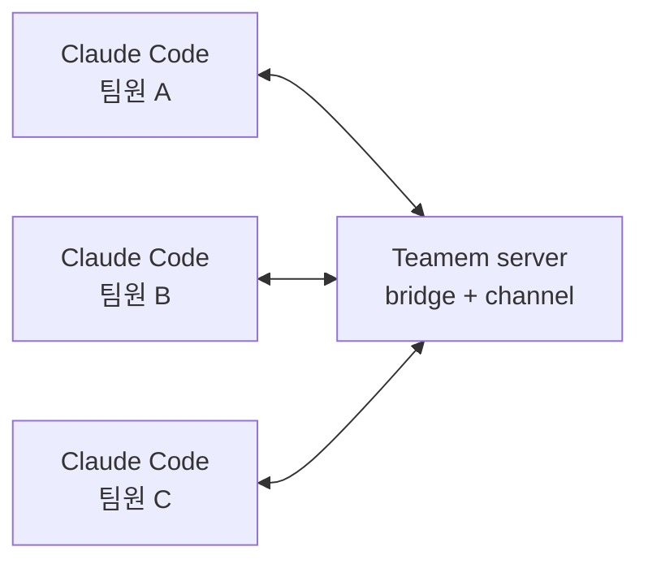

# Teamem

[English](README.md) | [한국어](README.ko.md)

Teamem은 사람과 코딩 에이전트를 위한 팀 메모리입니다. 같은 리포지토리에서
Claude Code를 쓰는 팀원들이 작업 맥락을 공유하고, 코드 수정 범위를 조율하고,
주요 결정사항들을 기록하며, 작업을 충돌없이 안전하게 이어갈 수 있게 돕기 위해 만들어졌습니다.

Teamem은 이런 상황에서 유용합니다:

- 여러 팀원이 하나의 코드베이스(리포지토리)에서 Claude Code를 함께 사용할 때
- 모든 팀원과 에이전트 세션이 현재 작업 방향, 결정, 트러블슈팅 내역 등을 알아야 할 때
- 커밋하면 자동으로 해제되는 파일 단위 클레임이 필요할 때
- 팀 지식을 특정 채팅 기록에만 남기지 않고 보존하고 싶을 때

## 빠른 시작

Teamem을 사용하려면 공유 서버가 먼저 필요합니다. 가장 빠른 경로는
[Teamem Cloud](https://teamem.cc)입니다. 호스팅된 Teamem 서버 URL, 참여
코드, 설정 명령어를 대시보드에서 받아 Claude Code와 함께 바로 시작할 수
있습니다.

### 바로 시작: Teamem Cloud

1. [Teamem Cloud](https://teamem.cc)를 열고 로그인합니다.
2. 무료 관리형 Space를 하나 만듭니다.
3. 대시보드에서 호스팅된 서버 URL, 참여 코드, 설정 명령어를 복사합니다.
4. 각 팀원 머신에서 설정 명령어를 실행한 뒤 Teamem이 소유한 `claude` shim을
   설치합니다:

```bash
teamem claude install
```

`teamem claude install`은 Teamem이 소유한 `claude` shim을 설치합니다. shim
디렉터리를 PATH 맨 앞에 두면 interactive `claude`는 실행할 때마다 Teamem
사용 여부를 묻습니다. 설치 명령은 shell startup 파일을 기본으로 수정하지
않으므로 출력된 PATH 안내를 직접 추가하세요:

```bash
export PATH="$HOME/.teamem/bin:$PATH"
```

그 다음 평소처럼 `claude`를 실행합니다. `claude --teamem`과 `claude --pure`는
명시적인 선택이고, non-interactive `claude`는 기본적으로 순수 Claude로
실행됩니다. Teamem 실행에 필요한 설정, credential, 플러그인 설치, 런타임
Space 준비가 부족하면 Claude Code를 열기 전에 막고 다음 복구 명령을
보여줍니다.

Teamem Cloud는 프로비저닝과 설정을 위한 control plane입니다. 실제 작업
흐름은 현재 Claude Code 플러그인, 브리지, git hook, 참여 코드, 클레임,
브리핑, 결정, 토론, Space Rules 런타임 흐름을 그대로 사용합니다.

설정 명령어가 부트스트래퍼 설치를 대신해 주지 않는다면 먼저 설치하세요:

```bash
npm install -g @rubiyh05/teamem
```

### 공유 서버 직접 호스팅

직접 서버를 운영하려면 이 저장소를 clone한 뒤 Docker Compose 또는 Bun으로
실행하세요.

Docker Compose로 실행:

```bash
git clone https://github.com/RubiYH/teamem.git
cd teamem
cp .env.example .env
# .env에 TEAMEM_JWT_SECRET을 설정하세요. 로컬 테스트 예시:
#   openssl rand -hex 32
docker compose up --build -d
```

Bun으로 직접 실행:

```bash
git clone https://github.com/RubiYH/teamem.git
cd teamem
bun install
cp .env.example .env
# .env에 TEAMEM_JWT_SECRET을 설정하세요. 로컬 테스트 예시:
#   openssl rand -hex 32
mkdir -p data
bun run server
```

서버가 준비되면 각 팀원 머신에 Bun이 설치되어 있는지 먼저 확인하세요:

```bash
curl -fsSL https://bun.sh/install | bash
```

그 다음 부트스트래퍼 CLI를 설치하고 Claude Code 설정을 진행하세요:

```bash
npm install -g @rubiyh05/teamem
teamem init
teamem claude install
```

`teamem init`은 필수 도구를 점검하고, `teamem-alpha` Claude Code
마켓플레이스를 추가하거나 갱신한 뒤, `teamem@teamem-alpha` 플러그인을
설치하고 스페이스 생성 또는 참여 설정을 실행합니다. Teamem git hook 설치도
선택할 수 있습니다. `teamem cc`는 이제 호환성 오류만 출력하며 Claude Code를
실행하지 않습니다. `teamem claude install`은 Teamem이 소유한 `claude` shim을
설치합니다. shim 디렉터리가 PATH 맨 앞에 있으면 interactive `claude`는 매번
Teamem 사용 여부를 묻고, `claude --teamem`과 `claude --pure`는 명시적으로
선택할 수 있습니다. non-interactive `claude`는 기본적으로 순수 Claude로
실행됩니다. 설치 명령은 shell startup 파일을 기본으로 수정하지 않으므로
출력된 PATH 안내를 직접 추가하세요. Teamem 실행 준비가 부족하면 Claude Code를
열기 전에 막고 다음 복구 명령을 보여줍니다.

> [!WARNING]
> Teamem은 현재 Claude Code의 실험적 Channels 기능으로 실시간 알림을
> 전달합니다. Channels 동작은 바뀔 수 있고, 일부 환경에서는 사용할 수 없을
> 수 있습니다. 이 경우 `/teamem-briefing`, `/teamem-status`, 읽지 않은
> 알림으로 확인해야 할 수 있습니다.

일반 온보딩은 PATH shim으로 Claude Code를 시작합니다. `claude`를 실행해
Teamem을 선택하거나 `claude --teamem ...`을 사용하세요. 이미 실행 중인
세션이 Teamem 활성화 없이 시작된 경우에는 launcher로 다시 시작하거나
필요할 때 읽기 명령을 사용하세요:

```text
/teamem-briefing
/teamem-status
```

지원 중단된 `/teamem-on` 활성화 명령은 더 이상 배포하지 않습니다. Teamem으로
시작한 세션에서는 평소처럼 편집하면 됩니다. Teamem 훅은 편집 전에 경로를
클레임하고, 커밋 후에는 `on_commit` 클레임을 해제합니다. 충돌이나 대기
중인 작업도 플러그인을 통해 확인할 수 있습니다.

## 작동 방식



```text
Claude Code plugin
  -> local Teamem bridge
  -> shared Teamem HTTP server
  -> SQLite event store and projections
```

핵심 읽기 도구는 `teamem.get_briefing`입니다. 세션 시작/재개, 명시적인
새로고침, 전체 팀 맥락 확인이 필요할 때 사용합니다. 편집 시점의 조율은
매번 전체 브리핑을 호출하지 않고 `teamem.claim_scope`,
`teamem.release_scope`, 결정, 발견 사항, 토론, 스페이스 관리 도구를 통해
더 가볍게 처리합니다.

## 제공 기능

| 기능 | 설명 |
| --- | --- |
| 브리핑 | 현재 계획, 활성 클레임, 최근 결정, 리스크, 진행 상황을 보여줍니다. |
| 작업 범위 클레임 | 에이전트가 파일이나 모듈을 편집하기 전에 작업 범위를 예약할 수 있습니다. |
| Git handoff | 일반 클레임을 커밋 시 해제하고, 브랜치를 전환할 때 클레임을 일시 중지하거나 재개합니다. |
| 결정과 주의사항 | `/teamem-decide`, `/teamem-gotcha`로 오래 남길 팀 지식을 기록합니다. |
| 토론 | `/teamem-discuss`로 특정 팀원 또는 전체 팀에 메시지를 보냅니다. |
| 스페이스 규칙 | 팀 규칙을 에이전트 프롬프트용 로컬 `TEAMEM.md` 캐시로 내보냅니다. |

## 주요 명령어

| 명령어 | 목적 |
| --- | --- |
| `teamem init` | Claude Code 플러그인을 설치하거나 갱신하고 온보딩을 실행합니다. |
| `teamem update` | 마켓플레이스와 설치된 플러그인을 갱신합니다. |
| `teamem claude install` | Teamem이 소유한 `claude` shim을 설치합니다. |
| `teamem claude uninstall` | `claude`를 unwrap하고 기본 Claude Code 명령으로 되돌립니다. |
| `teamem cc` | 호환성 오류입니다. 기존 사용자에게 launcher migration을 안내합니다. |
| `/teamem-off` | 현재 세션에서 Teamem을 끕니다. |
| `/teamem-briefing` | 팀 맥락 브리핑을 가져옵니다. |
| `/teamem-status` | 활성화 상태, 모니터 상태, 최근 알림을 확인합니다. |
| `/teamem-decide` | 아키텍처, 제품, 계획, 프로세스 결정을 기록합니다. |
| `/teamem-discuss` | 직접 또는 전체 팀 토론 메시지를 보냅니다. |
| `/teamem-space` | 나가기, 내보내기, 참여 코드 교체 같은 멤버십 작업을 관리합니다. |

## 로드맵

현재 빌드는 의도적으로 좁은 범위에 집중합니다. Claude Code 우선, 큐 기반
조율, Teamem Cloud 또는 팀이 직접 운영하는 공유 서버가 기본 전제입니다.
프로젝트 문서에 남아 있는 주요 백로그는 다음과 같습니다:

| 영역 | 남은 작업 |
| --- | --- |
| 실시간 전달 | polling과 실험적 Channels를 넘어, 플랫폼 지원이 안정되면 더 안정적인 push 전송 방식으로 옮겨갑니다. |
| 충돌 처리 | 실제 사용에서 충돌 신호가 충분히 믿을 만하다고 확인되면 편집을 막는 hard-gate 모드를 추가합니다. |
| 자동 토론 | `auto-discuss`용 백그라운드 협상 에이전트를 다시 검토합니다. 현재는 오래된 `auto-discuss` 설정도 큐에 넣는 방식으로 처리됩니다. |
| 더 넓은 도구 지원 | Claude Code 경로가 안정된 뒤 다른 코딩 에이전트 런타임용 어댑터를 다시 추가합니다. |
| 여러 저장소 지원 | 한 저장소 안의 경로뿐 아니라 관련 저장소들 사이의 공유 계약과 리스크도 조율합니다. |
| 보안과 운영 | 더 강한 팀원 식별, 쉬운 서버 운영 흐름, 큰 팀을 위한 관리자 기능을 추가합니다. |

## 기여

로컬에서 Teamem을 실행할 때는 위의 빠른 시작 서버 설정을 사용하세요.
영구 플러그인 설치는 `teamem init`과 `teamem update`를 사용해 Claude Code가
마켓플레이스 artifact를 로드하게 하세요. 플러그인 자체를 이 checkout에서
개발할 때는 현재 Claude Code 세션에 source tree를 로드하세요:

```bash
claude --plugin-dir /absolute/path/to/teamem-poc/plugin
```

Teamem-aware launcher shim을 통해 테스트할 때는 `--teamem`을 추가하세요:

```bash
claude --teamem --plugin-dir /absolute/path/to/teamem-poc/plugin
```

## 문서

- [Quickstart](docs/getting-started/quickstart.md)
- [Claude Code plugin guide](docs/integrations/claude-code-plugin.md)
- [Local development](docs/getting-started/local-dev.md)
- [Teamem Cloud deployment](docs/deploy/teamem-cloud.md)
- [Architecture](docs/architecture.md)
- [Hooks](docs/integrations/hooks.md)
- [VPS deployment](docs/deploy/vps.md)
- [Troubleshooting](docs/troubleshooting.md)

## 상태

Teamem은 초기 공개 PoC 단계입니다. 아직 실제 상황에서 충분히 테스트하지는
못했지만, 곧 팀원과 실제 프로젝트에서 테스트할 예정입니다. 앞으로 개선과
기능 추가가 계속될 수 있습니다!
npm 패키지는 Claude Code 플러그인을 설치하기 위한 부트스트래퍼이며, 실제
런타임은 플러그인과 공유 서버입니다.
