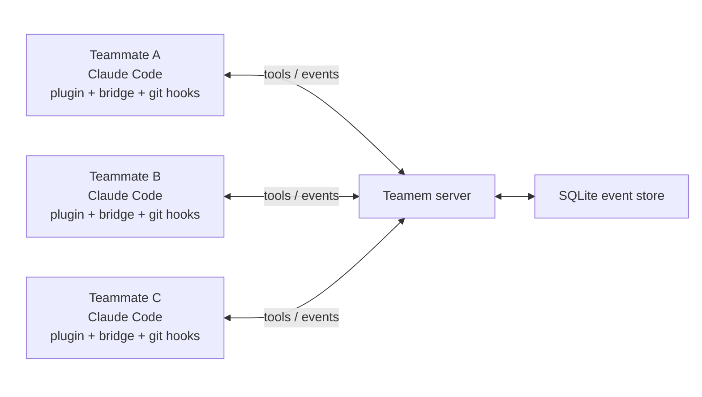

# Teamem

[English](README.md) | [한국어](README.ko.md)
  
  
> <p align="center"><em>Tired of merge conflicts on every PR, even with coding agents?</em></p>
>  
> <p align="center"><em>With Teamem, no more "my Claude Code edited that first," "can I edit this file now?", "how did you fix that?", or "wait, are we skipping the user page implementation? I never heard of that!"</em></p>
  
  

Teamem is team memory for humans and their coding agents. It is built to help
teammates using Claude Code in the same repository share work context,
coordinate code-editing scope, record important decisions, and keep work moving
safely without conflicts.

Teamem is useful when:

- multiple teammates are using Claude Code in one codebase or repository;
- you want every teammate and agent session to know the current direction,
  decisions, and troubleshooting history;
- you need file claims that release automatically when work is committed;
- you want team knowledge to live outside one chat transcript.

## Quick Start

Teamem needs a shared server. The quickest path is
[Teamem Cloud](https://teamem.cc): it gives your team a hosted Teamem server
URL, room code, and setup command so you can start with Claude Code without
running the server yourself.

### Shortcut: Teamem Cloud

1. Open [Teamem Cloud](https://teamem.cc) and sign in.
2. Create one free managed Space.
3. Copy the hosted server URL, room code, and setup command from the dashboard.
4. Run the setup command on each teammate machine, then launch Claude Code:

```bash
teamem cc
```

Teamem Cloud is the provisioning and setup control plane. Your team still uses
the current Claude Code plugin, bridge, git hooks, room codes, claims,
briefings, decisions, discussions, and Space Rules runtime flow.

If the setup command does not install the bootstrapper for you, install it
first:

```bash
npm install -g @rubiyh05/teamem
```

### Self-host the shared server

If you want to run your own Teamem server, use a server your team already runs,
or clone this repository and self-host it.

With Docker Compose:

```bash
git clone https://github.com/RubiYH/teamem.git
cd teamem
cp .env.example .env
# Set TEAMEM_JWT_SECRET in .env. For local testing:
#   openssl rand -hex 32
docker compose up --build -d
```

Or directly with Bun:

```bash
git clone https://github.com/RubiYH/teamem.git
cd teamem
bun install
cp .env.example .env
# Set TEAMEM_JWT_SECRET in .env. For local testing:
#   openssl rand -hex 32
mkdir -p data
bun run server
```

After the server is available, install Bun on each teammate machine if it is
not already available:

```bash
curl -fsSL https://bun.sh/install | bash
```

Then install the bootstrapper CLI and run the guided Claude Code setup:

```bash
npm install -g @rubiyh05/teamem
teamem init
teamem cc
```

`teamem init` checks prerequisites, adds or refreshes the `teamem-alpha` Claude
Code marketplace, installs the `teamem@teamem-alpha` plugin, runs the space
create or join setup flow, and can install Teamem git hooks. `teamem cc`
launches Claude Code with the Teamem development channel enabled.

> [!WARNING]
> Teamem currently uses Claude Code's experimental Channels feature for live
> delivery. Channel behavior may change, be unavailable in some environments,
> or require fallback to `/teamem-briefing`, `/teamem-status`, and unread
> notifications.

Inside Claude Code:

```text
/teamem-on
/teamem-on --persist
/teamem-briefing
```

Use `/teamem-on --persist` when this repository should default to Teamem being
on in future Claude Code sessions. From there, edit normally. Teamem hooks claim
paths before edits, release `on_commit` claims after commits, and surface
conflicts or queued work through the plugin.

## How it works



```text
Claude Code plugin + git hooks
  -> local Teamem bridge
  -> shared Teamem HTTP server
  -> SQLite event store and projections
```

The main read tool is `teamem.get_briefing`, used for session start/resume,
explicit refreshes, and whole-team context checks. Edit-time coordination should
stay lighter: hooks and agents use `teamem.claim_scope`, `teamem.release_scope`,
decisions, findings, discussions, and space-management tools instead of calling a
full briefing before every edit.

## What You Get

| Feature | What it does |
| --- | --- |
| Briefings | Shows the current plan, active claims, recent decisions, risks, and progress. |
| Scope claims | Lets agents reserve files or modules before editing them. |
| Git handoffs | Releases normal claims on commit and pauses or resumes claims on branch checkout. |
| Decisions and gotchas | Captures durable team knowledge through `/teamem-decide` and `/teamem-gotcha`. |
| Discussions | Sends direct or broadcast coordination messages with `/teamem-discuss`. |
| Space rules | Exports team rules into a local `TEAMEM.md` cache for agent prompts. |

## Common Commands

| Command | Purpose |
| --- | --- |
| `teamem init` | Install or update the Claude Code plugin and run onboarding. |
| `teamem update` | Refresh the marketplace and installed plugin. |
| `teamem cc` | Launch Claude Code with Teamem enabled. |
| `/teamem-on` | Activate Teamem hooks and monitoring for the current session. |
| `/teamem-on --persist` | Make Teamem default to on for future Claude Code sessions in this repo. |
| `/teamem-off` | Silence Teamem for the current session. |
| `/teamem-briefing` | Fetch the team context briefing. |
| `/teamem-status` | Check activation, monitor health, and recent notifications. |
| `/teamem-decide` | Record an architectural, product, plan, or process decision. |
| `/teamem-discuss` | Send a direct or broadcast discussion message. |
| `/teamem-space` | Manage membership actions such as leave, kick, and rotate code. |

## Roadmap

The current build is intentionally narrow: Claude Code first, queue-first
coordination, and a self-hosted server. Backlog items already captured in the
project docs include:

| Area | What remains |
| --- | --- |
| Live delivery | Move beyond polling and experimental Channels toward a stable push transport when the platform support is ready. |
| Conflict handling | Add a hard-gate mode after real-world usage proves the conflict signals are reliable enough to block edits. |
| Auto-discussion | Revisit background negotiator agents for `auto-discuss`; today stale `auto-discuss` settings degrade to queued work. |
| Broader tool support | Reintroduce adapters for other coding-agent harnesses after the Claude Code path is stable. |
| Multi-repo teams | Coordinate shared contracts and risks across related repositories, not only paths inside one repo. |
| Security and operations | Add stronger teammate identity, easier server lifecycle tooling, and more admin controls for larger teams. |

## Contribute

Use the Quick Start server setup above when running Teamem locally. When
developing the plugin itself, install it from the checkout:

```bash
claude plugin install ./plugin --scope project
```

Project-scope installs make the plugin available to everyone using the repo.
User-scope installs work for personal testing.

## Documentation

- [Quickstart](docs/getting-started/quickstart.md)
- [Claude Code plugin guide](docs/integrations/claude-code-plugin.md)
- [Local development](docs/getting-started/local-dev.md)
- [Architecture](docs/architecture.md)
- [Hooks](docs/integrations/hooks.md)
- [VPS deployment](docs/deploy/vps.md)
- [Troubleshooting](docs/troubleshooting.md)

## Status

Teamem is in an early public PoC stage. I haven't tested much in real-life situations but will test soon in real projects with my teammate, so expect further improvements and features!
The npm package is a bootstrapper for the
Claude Code plugin; the plugin and shared server are the runtime.

## Contribution

I always welcome contributions and am open to improving Teamem together. I'll set
up contribution rules and related guidance very soon. If you have any questions,
feel free to contact me at imrubi5555@gmail.com.
