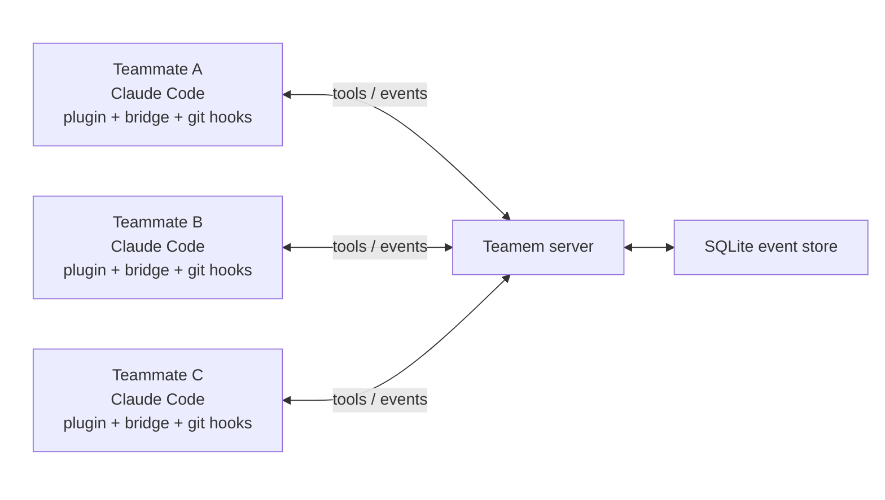

# Teamem

[English](README.md) | [한국어](README.ko.md)
  
  
> <p align="center"><em>Tired of merge conflicts on every PR, even with coding agents?</em></p>
>  
> <p align="center"><em>With Teamem, no more "my Claude Code edited that first," "can I edit this file now?", "how did you fix that?", or "wait, are we skipping the user page implementation? I never heard of that!"</em></p>
  
  

Teamem is team memory for humans and their coding agents. It is built to help
teammates using Claude Code in the same repository share work context,
coordinate code-editing scope, record important decisions, and keep work moving
safely without conflicts.

Teamem is useful when:

- multiple teammates are using Claude Code in one codebase or repository;
- you want every teammate and agent session to know the current direction,
  decisions, and troubleshooting history;
- you need file claims that release automatically when work is committed;
- you want team knowledge to live outside one chat transcript.

## Quick Start

Teamem has two parts:

- a shared Teamem server, either hosted by Teamem Cloud or self-hosted by your
  team;
- a local Teamem bootstrapper and Claude Code plugin on each teammate machine.

### 1. Install the Teamem CLI

Install Bun first if you do not already have it:

```bash
curl -fsSL https://bun.sh/install | bash
```

Then install the Teamem bootstrapper:

```bash
npm install -g @rubiyh05/teamem
```

### 2. Choose a shared server

#### Option A: Teamem Cloud

Use [Teamem Cloud](https://teamem.cc) when you want the fastest path and do not
want to run the server yourself.

1. Open [Teamem Cloud](https://teamem.cc) and sign in.
2. Create one free managed Space.
3. Copy the hosted server URL, room code, and setup command from the dashboard.
4. Run that setup command on each teammate machine.

Teamem Cloud is the provisioning and setup control plane. Your team still uses
the current Claude Code plugin, bridge, git hooks, room codes, claims,
briefings, decisions, discussions, and Space Rules runtime flow.

#### Option B: Self-host

Use self-hosting when your team wants to run the Teamem server. Follow the
[self-host guide](docs/deploy/self-host.md) to start the server, then run the
generated setup command on each teammate machine.

### 3. Install the Claude launcher

After setup succeeds on a teammate machine, install the opt-in Teamem-aware
Claude launcher:

```bash
teamem claude install
```

The install command prepares the machine-local launcher state and shim. The
launcher does not edit shell startup files by default. Add the printed PATH
line yourself, usually:

```bash
export PATH="$HOME/.teamem/bin:$PATH"
```

Once the shim directory is first on `PATH`, start Claude Code the usual way:

```bash
claude
```

> Teamem installs an opt-in local `claude` launcher shim. Teamem is not
> affiliated with Anthropic. The shim does not handle Claude credentials or
> proxy Claude requests; it prompts whether to launch Claude Code with Teamem
> plugin activation or as pure Claude Code, then execs the real Claude Code
> binary. Remove it with `teamem claude uninstall`.

Interactive `claude` launches ask whether to start with Teamem or stay pure.
Non-interactive launches stay pure unless you pass `claude --teamem ...`; use
`claude --pure ...` to force the pure path. A Teamem launch blocks before
opening Claude Code when setup, credentials, plugin install, or runtime Space
readiness is missing, and prints the repair command to run next.

### 4. Start working in Claude Code

> [!WARNING]
> Teamem currently uses Claude Code's experimental Channels feature for live
> delivery. Channel behavior may change, be unavailable in some environments,
> or require fallback to `/teamem-briefing`, `/teamem-status`, and unread
> notifications.

Normal onboarding starts Claude Code through the PATH shim: run `claude` and
choose Teamem, or use `claude --teamem ...`. If an already-running session was
launched without Teamem activation, restart it through the launcher or use
on-demand read commands:

```text
/teamem-briefing
/teamem-status
```

The deprecated `/teamem-on` activation command is no longer shipped. From a
Teamem-launched session, edit normally. Teamem hooks claim paths before edits,
release `on_commit` claims after commits, and surface conflicts or queued work
through the plugin.

## How it works



```text
Claude Code plugin + git hooks
  -> local Teamem bridge
  -> shared Teamem HTTP server
  -> SQLite event store and projections
```

The main read tool is `teamem.get_briefing`, used for session start/resume,
explicit refreshes, and whole-team context checks. Edit-time coordination should
stay lighter: hooks and agents use `teamem.claim_scope`, `teamem.release_scope`,
decisions, findings, discussions, and space-management tools instead of calling a
full briefing before every edit.

## What You Get

| Feature | What it does |
| --- | --- |
| Briefings | Shows the current plan, active claims, recent decisions, risks, and progress. |
| Scope claims | Lets agents reserve files or modules before editing them. |
| Git handoffs | Releases normal claims on commit and pauses or resumes claims on branch checkout. |
| Decisions and gotchas | Captures durable team knowledge through `/teamem-decide` and `/teamem-gotcha`. |
| Discussions | Sends direct or broadcast coordination messages with `/teamem-discuss`. |
| Space rules | Exports team rules into a local `TEAMEM.md` cache for agent prompts. |

## Common Commands

| Command | Purpose |
| --- | --- |
| `teamem init` | Install or update the Claude Code plugin and run onboarding. |
| `teamem update` | Refresh the marketplace and installed plugin. |
| `teamem claude install` | Install the opt-in Teamem-aware `claude` launcher. |
| `teamem claude uninstall` | Unwrap `claude` and restore the normal Claude Code command. |
| `teamem cc` | Compatibility error; it points existing users toward the launcher migration. |
| `/teamem-off` | Silence Teamem for the current session. |
| `/teamem-briefing` | Fetch the team context briefing. |
| `/teamem-status` | Check activation, monitor health, and recent notifications. |
| `/teamem-decide` | Record an architectural, product, plan, or process decision. |
| `/teamem-discuss` | Send a direct or broadcast discussion message. |
| `/teamem-space` | Manage membership actions such as leave, kick, and rotate code. |

## Roadmap

The current build is intentionally narrow: Claude Code first, queue-first
coordination, and a shared server that can be hosted by Teamem Cloud or run by
your team. Backlog items already captured in the project docs include:

| Area | What remains |
| --- | --- |
| Live delivery | Move beyond polling and experimental Channels toward a stable push transport when the platform support is ready. |
| Conflict handling | Add a hard-gate mode after real-world usage proves the conflict signals are reliable enough to block edits. |
| Auto-discussion | Revisit background negotiator agents for `auto-discuss`; today stale `auto-discuss` settings degrade to queued work. |
| Broader tool support | Reintroduce adapters for other coding-agent harnesses after the Claude Code path is stable. |
| Multi-repo teams | Coordinate shared contracts and risks across related repositories, not only paths inside one repo. |
| Security and operations | Add stronger teammate identity, easier server lifecycle tooling, and more admin controls for larger teams. |

## Contribute

Use the Quick Start server setup above when running Teamem locally. For
persistent plugin installs, use `teamem init` and `teamem update` so Claude Code
loads the marketplace artifact. When developing the plugin itself from this
checkout, load the source tree for the current Claude Code session:

```bash
claude --plugin-dir /absolute/path/to/teamem-poc/plugin
```

Add `--teamem` when testing through the Teamem-aware launcher shim:

```bash
claude --teamem --plugin-dir /absolute/path/to/teamem-poc/plugin
```

## Documentation

- [Quickstart](docs/getting-started/quickstart.md)
- [Claude Code plugin guide](docs/integrations/claude-code-plugin.md)
- [Local development](docs/getting-started/local-dev.md)
- [Teamem Cloud deployment](docs/deploy/teamem-cloud.md)
- [Architecture](docs/architecture.md)
- [Hooks](docs/integrations/hooks.md)
- [VPS deployment](docs/deploy/vps.md)
- [Troubleshooting](docs/troubleshooting.md)

## Status

Teamem is in an early public PoC stage. I haven't tested much in real-life situations but will test soon in real projects with my teammate, so expect further improvements and features!
The npm package is a bootstrapper for the
Claude Code plugin; the plugin and shared server are the runtime.

## Contribution

I always welcome contributions and am open to improving Teamem together. I'll set
up contribution rules and related guidance very soon. If you have any questions,
feel free to contact me at imrubi5555@gmail.com.
